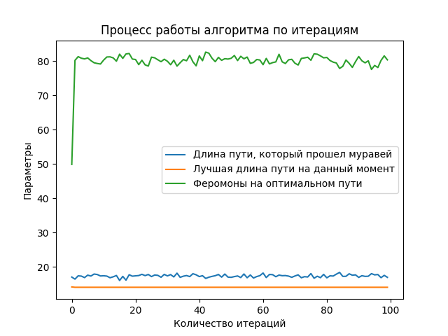

## Муравьиный алгоритм

**Для начала работы**
- склонируйте проект (`git clone`)
- перейдите в директорию (`cd ant-colony`)
- соберите зависимости (`uv sync`)
- скомпилируйте проект (`compile.bat`)
- попробуйте изменить конфигурацию и перезапустить проект (`run.bat`)

**Ic - INI-подобный синтаксис**

```ic
; ================================
; КОНФИГУРАЦИЯ АЛГОРИТМА МУРАВЬИНОЙ КОЛОНИИ
; ================================
;
; Синтаксис:
;   [секция]       - объявление секции параметров (по умолчанию `main`)
;   ключ: значение - параметр и его значение
;   ; комментарий  - строка комментария (игнорируется)
;	; если требуется вернуться из секции [graph] в секцию `main` можно просто написать `[]` или `main`
;	; в программу принимается `.ic` формат
;
; Все параметры опциональны. Некоторые значения есть в программе по умолчанию
```


**Пример конфигурации:**
```ic
; Конфигурация для муравьиного алгоритма

[graph]
; описание графа
file: ./input/1.txt ; путь к файлу
oriented: true ; ориентированный ли граф
head: false ; есть ли заголовок внутри файла

[ant]
; параметры муравья
rho: 0.05 ; скорость испарения феромонов
alpha: 1.0 ; параметр, контролирующий влияние феромона
beta: 1.0 ; параметр, контролирующий влияние привлекательности ребра

[colony]
; описание колонии

; обязательные параметры
nants: 50; количество муравьев в одной пачке
iters: 30 ; фиксированное количество итераций
Q: 10 ; количество феромонов

; необязательные параметры для алгоритма
; init: 1.0 ; начальное значение феромона (по умолчанию 1.0)
; packs: 5 ; количество пачек (по умолчанию 1 пачка)

; если мы хотим найти оптимальный путь, который не изменяется в течение n_iters итераций на значение eps
eps: 0.01 ; значение eps, на которое может измениться оптимальный путь
n_iters: 20 ; за какое количество итераций оптимальный путь не меняется

; максимальное количество итераций (по умолчанию 1000)
max_iters: 100

[output]
csv файл, в который мы записываем путь каждого муравья
output_file: ./output/output.csv
```

**Результат работы алгоритма (запуск `run.bat`)**
```bash
run project...
Best path length: 125
Path: 3 14 12 2 6 19 11 4 1 18 16 0 9 15 8 5 13 17 10 7 3
No args provided
False

Записей в таблице: 1749 (считаем от нуля)
Количество неполных путей: 0
Количество полных путей: 1749
Количество итераций: 35
Количество муравьев на одну итерацию: 50
Найденные лучшие пути: [482. 417. 359. 323. 268. 219. 210. 195. 188. 180. 155. 141. 140. 125.]
Максимальное количество феромона на оптимальном пути: 881.043
Минимальное количество феромона на оптимальном пути: 20.1245

      Iteration  CurrentBestLength  AntId  ...  PathType     Phers  PhersOptimal
1             0              482.0      2  ...         1   380.830       20.1245
2             0              417.0      3  ...         1   381.789       21.0837
3             0              417.0      4  ...         1   382.452       21.1500
4             0              417.0      5  ...         1   383.330       21.2816
5             0              417.0      6  ...         1   383.986       21.3802
...         ...                ...    ...  ...       ...       ...           ...
1745         34              125.0   1746  ...         1  2309.880      877.7140
1746         34              125.0   1747  ...         1  2312.460      879.1330
1747         34              125.0   1748  ...         1  2314.060      879.8530
1748         34              125.0   1749  ...         1  2315.100      880.2670
1749         34              125.0   1750  ...         1  2316.390      881.0430

[1749 rows x 8 columns]
           CurrentBestLength   AntId  ...        Phers  PhersOptimal
Iteration                             ...
0                 328.367347    26.0  ...   401.531714     24.486449
1                 229.780000    75.5  ...   444.717740     36.892744
2                 216.840000   125.5  ...   487.010680     48.754102
3                 207.300000   175.5  ...   535.370460     61.765556
4                 195.000000   225.5  ...   586.893560     74.495212
5                 192.060000   275.5  ...   637.292420     94.274512
6                 187.200000   325.5  ...   690.498820    119.830760
7                 162.500000   375.5  ...   748.584540    125.830880
8                 155.000000   425.5  ...   805.990240    137.026420
9                 148.560000   475.5  ...   861.612200    177.111640
10                141.000000   525.5  ...   918.126680    226.980640
11                140.440000   575.5  ...   975.597800    241.078220
12                140.000000   625.5  ...  1029.463800    255.663060
13                140.000000   675.5  ...  1083.212000    277.282640
14                129.800000   725.5  ...  1141.872200    317.915940
15                125.000000   775.5  ...  1199.235600    349.999600
16                125.000000   825.5  ...  1258.858200    376.491840
17                125.000000   875.5  ...  1316.802600    402.312360
18                125.000000   925.5  ...  1374.206400    429.089320
19                125.000000   975.5  ...  1435.710000    458.772400
20                125.000000  1025.5  ...  1492.496800    484.639080
21                125.000000  1075.5  ...  1548.548400    511.143460
22                125.000000  1125.5  ...  1607.377400    539.590500
23                125.000000  1175.5  ...  1667.171000    566.879280
24                125.000000  1225.5  ...  1721.884600    590.441100
25                125.000000  1275.5  ...  1774.142600    613.784920
26                125.000000  1325.5  ...  1828.280400    638.800900
27                125.000000  1375.5  ...  1881.636400    665.405820
28                125.000000  1425.5  ...  1938.740600    693.351480
29                125.000000  1475.5  ...  1993.956400    721.345540
30                125.000000  1525.5  ...  2053.040600    750.073640
31                125.000000  1575.5  ...  2110.462800    778.628200
32                125.000000  1625.5  ...  2166.427400    805.707800
33                125.000000  1675.5  ...  2221.597000    833.361060
34                125.000000  1725.5  ...  2279.221600    863.209000

[35 rows x 6 columns]
```


<div align="center">

</div>

**Описание работы:**

