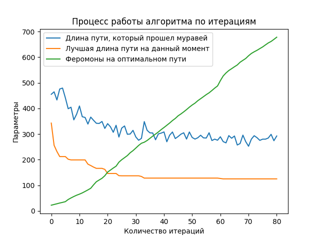
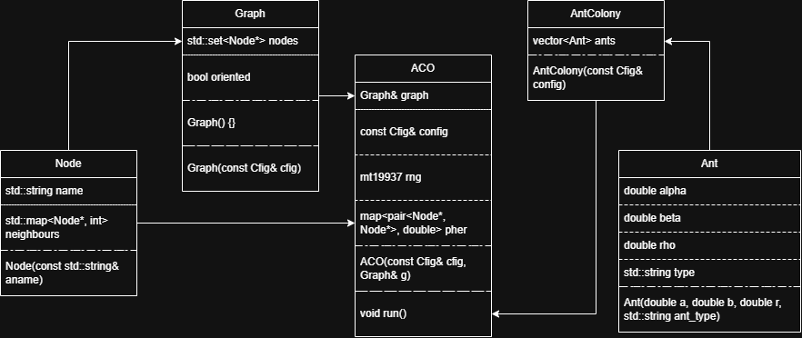
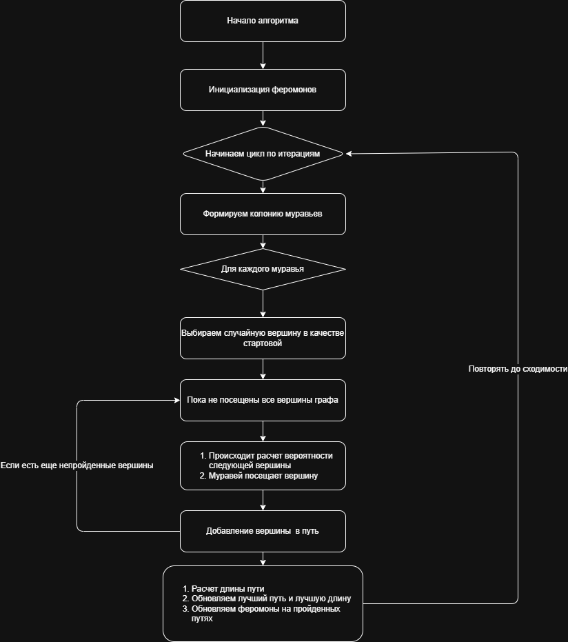

## Муравьиный алгоритм

### Описание работы алгоритма
**Алгоритм оптимизации подражанием муравьиной колонии:**
1. Муравей проходит случайным образом от колонии
2. Если он находит путь к источнику пищи, то возвращается в гнездо, оставляя за собой след из феромона
3. Эти феромоны привлекают других муравьёв 
4. Вернувшись в гнездо они укрепят феромонную тропу
5. Если существует 2 маршрута, то по более короткому, за то же время, успеют пройти больше муравьёв, чем по длинному
6. Короткий маршрут станет более привлекательным
7. Длинные пути, в конечном итоге, исчезнут из-за испарения феромонов


### Начало работы
1. **Склонируйте проект**
```bash
git clone https://github.com/groknut/ant-colony.git
cd ant-colony
```
2. **Соберите зависимости**
```bash
uv sync
```
3. **Запустите проект**
```bash
uv run app.py
```

### Конфигурация проекта
```ini
# Конфигурация для муравьиного алгоритма
[app]
name = main

[graph]
# описание графа
file = ./input/ai.txt # путь к файлу
oriented = true # ориентированный ли граф
head = false # есть ли заголовок внутри файла

[test.ant]
# параметры тестового муравья
rho = 0.01 # скорость испарения феромонов
alpha = 1.0 # параметр, контролирующий влияние феромона
beta = 1.0 # параметр, контролирующий влияние привлекательности ребра

[king.ant]
# параметры королевского муравья
rho = 0.01 # скорость испарения феромонов
alpha = 2.0 # параметр, контролирующий влияние феромона
beta = 2.0 # параметр, контролирующий влияние привлекательности ребра

[colony]
king.ant = 10
test.ant = 20

[aco]
iters = 80 # фиксированное количество итераций
Q = 20 # количество феромонов

# необязательные параметры для алгоритма
# init = 1.0 # начальное значение феромона (по умолчанию 1.0)

# если мы хотим найти оптимальный путь, который не изменяется в течение n_iters итераций на значение eps
eps = 0.01 # значение eps, на которое может измениться оптимальный путь
n_iters = 80 # за какое количество итераций оптимальный путь не меняется

# максимальное количество итераций (по умолчанию 1000)
max_iters = 10000

[output]
# csv файл, в который мы записываем путь каждого муравья
output_file = ./output/output.csv
graphic = ./output/graphic.png
mean_graphic = ./output/mean_graphic.png
```

### Результат работы алгоритма

#### Процесс работы алгоритма


#### Процесс работы алгоритма (параметры усреднены по итерациям)
<div align="center">

</div>

#### Работа алгоритма





