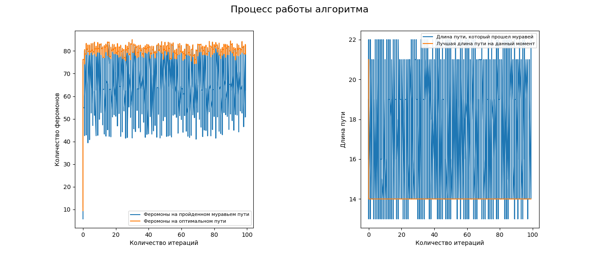
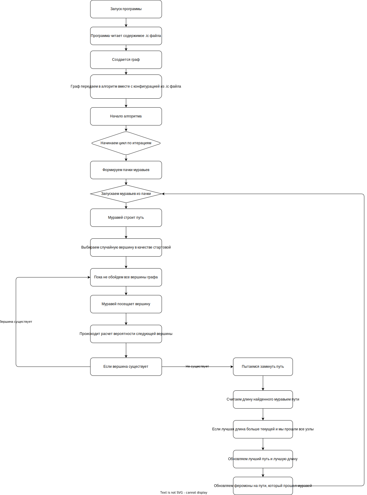

## Муравьиный алгоритм

**Для начала работы**
- склонируйте проект (`git clone`)
- перейдите в директорию (`cd ant-colony`)
- соберите зависимости (`uv sync`)
- скомпилируйте проект (`compile.bat`)
- попробуйте изменить конфигурацию и перезапустить проект (`run.bat`)

**Ic - INI-подобный синтаксис**

```ic
; ================================
; КОНФИГУРАЦИЯ АЛГОРИТМА МУРАВЬИНОЙ КОЛОНИИ
; ================================
;
; Синтаксис:
;   [секция]       - объявление секции параметров (по умолчанию `main`)
;   ключ: значение - параметр и его значение
;   ; комментарий  - строка комментария (игнорируется)
;	; если требуется вернуться из секции [graph] в секцию `main` можно просто написать `[]` или `main`
;	; в программу принимается `.ic` формат
;
; Все параметры опциональны. Некоторые значения есть в программе по умолчанию
```


**Пример конфигурации:**
```ic
; Конфигурация для муравьиного алгоритма

[graph]
; описание графа
file: ./input/1.txt ; путь к файлу
oriented: true ; ориентированный ли граф
head: false ; есть ли заголовок внутри файла

[ant]
; параметры муравья
rho: 0.05 ; скорость испарения феромонов
alpha: 1.0 ; параметр, контролирующий влияние феромона
beta: 1.0 ; параметр, контролирующий влияние привлекательности ребра

[colony]
; описание колонии

; обязательные параметры
nants: 50; количество муравьев в одной пачке
iters: 30 ; фиксированное количество итераций
Q: 10 ; количество феромонов

; необязательные параметры для алгоритма
; init: 1.0 ; начальное значение феромона (по умолчанию 1.0)
; packs: 5 ; количество пачек (по умолчанию 1 пачка)

; если мы хотим найти оптимальный путь, который не изменяется в течение n_iters итераций на значение eps
eps: 0.01 ; значение eps, на которое может измениться оптимальный путь
n_iters: 20 ; за какое количество итераций оптимальный путь не меняется

; максимальное количество итераций (по умолчанию 1000)
max_iters: 100

[output]
csv файл, в который мы записываем путь каждого муравья
output_file: ./output/output.csv
```

**Результат работы алгоритма (запуск `run.bat`)**
```bash
run project...
"1.txt" file
a       b       3
a       f       1
b       a       3
b       g       3
b       c       8
c       b       3
c       g       1
c       d       1
d       c       8
d       f       1
f       d       3
f       a       3
g       a       3
g       b       3
g       c       3
g       d       5
g       f       4
Best path length: 14
Path: d f a b g c d

Записей в таблице: 4997 (считаем от нуля)
Количество неполных путей: 1319
Количество полных путей: 3678
Количество итераций: 100
Количество муравьев на одну итерацию: 50
Найденные лучшие пути: [21. 14.]
Максимальное количество феромона на оптимальном пути: 85.2235
Минимальное количество феромона на оптимальном пути: 11.711

      Iteration  CurrentBestLength  AntId  ...  PathType    Phers  PhersOptimal
3             0               21.0      4  ...         1   7.1500       17.4023
4             0               21.0      5  ...         1  12.1493       17.4023
5             0               21.0      6  ...         1  11.7110       11.7110
6             0               14.0      7  ...         1  18.6456       19.1113
7             0               14.0      8  ...         1  19.7541       19.7541
...         ...                ...    ...  ...       ...      ...           ...
4995         99               14.0   4996  ...         1  65.6225       82.9058
4996         99               14.0   4997  ...         1  82.5272       82.5272
4997         99               14.0   4998  ...         0  51.9074       82.8459
4998         99               14.0   4999  ...         1  63.3475       82.8459
4999         99               14.0   5000  ...         1  82.8459       82.8459

[4997 rows x 8 columns]
           CurrentBestLength   AntId  ...      Phers  PhersOptimal
Iteration                             ...
0                  14.446809    27.0  ...  41.027143     52.026268
1                  14.000000    75.5  ...  65.646186     77.036904
2                  14.000000   125.5  ...  68.669920     81.257852
3                  14.000000   175.5  ...  65.522290     78.909228
4                  14.000000   225.5  ...  69.005408     79.488976
...                      ...     ...  ...        ...           ...
95                 14.000000  4775.5  ...  64.158738     78.332258
96                 14.000000  4825.5  ...  70.529854     81.040190
97                 14.000000  4875.5  ...  66.425224     81.056098
98                 14.000000  4925.5  ...  64.469202     79.686682
99                 14.000000  4975.5  ...  68.819556     81.065384

[100 rows x 6 columns]
```

>


**Описание работы:**

